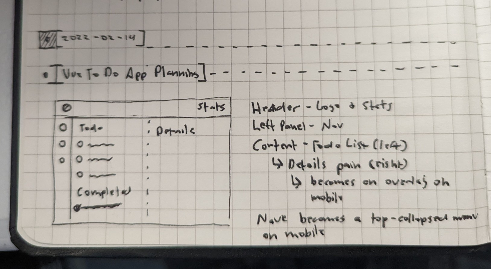

# 100 Days Of Code - Log

## Day 3: February 16, 2022

**Today's Progress:** UI Tweaks, animations, Pinia state, and more Composition API diving.
- Still toying with the Composition API and learning how best to use it
    - I tried working with "emits" but was having issues, will look into later
    - Moved most things into Pinia State as it was easier to maange that way
- Worked more with animations, but am struggling with making the sidenav slide open
    - Will be spending more time on this later and really mastering Vue's transitions
- Laid out more of the UI and looking for ways to breakup components to make them smaller and more concise
- Added details pane
- Added icons for routes, adding new todo, closing todo details pane
- Added filters for todos list
- Made general app and todo list page responsive

**Thoughts:** I am still in the "figuring" out stage. My plan is to poke around vue the rest of the week and rewrite the app next week to be more efficient, have cleaner code, and allow me to dissect the project. I have been referencing the docs more and am getting more comfortable with them.

**Link to work:** In the 'vue-js-todo-app' folder

**Image:** 

## Day 2: February 15, 2022

**Today's Progress:** Composition API and transitions.
- I am learning the ins and outs of the composition API as I have not had a lot of experience with it
    - I have only really used the Options API previously
- I am learning to manage state better and working with Pinia
- Working with transitions, and more speicifically adding and removing items from the list
- Improving use of the documentation to increase comprehension of frameworks

**Thoughts:** My primary goal today was to work on using the composition API more, using Pinia for state management, and relearning transitions with Vue. I am trying to better utilize the documentation of web technology to accomplish my goals. I know what I am trying the make and the docs should have all the details I need to make it happen.

**Link to work:** In the 'vue-js-todo-app' folder

**Image:** 

***

## Day 1: February 14, 2022

**Today's Progress**: Started the Vue Todos App project
- Got most requirements gathered and started the Vue 3 project
    - Using Vue and TailwindCSS primarily
- Sketched general design to use
- Cleaned up the boilerplate/demo code and got the base structure down
- Noted most components that will be needed (still trying to identify some.)

**Thoughts:** A productive day and trying to take a measured approach to the apps design and evelopment. Still working on requirements and end design.

**Link to work:** In the 'vue-js-todo-app' folder

**Image:**

***

## Day 0: February 13, 2022

**Today's Progress**: Created repository and planning my learning and projects out for the next 100 days.
- I will start by building a complete "to do" application with the four frontends I am going to learn.
- I am going to start with brushing up on Vue since I am already familiar with it.
- I will move on to Svelte after, then Solid JS, and lastly Alpine JS.
- From there I will build a different application with each.
- My goal is to start this tomorrow (2/14/2022)

**Thoughts:** I want to have some versatility when it comes to building web apps. I don't want to pigeonhole myself with only Vue. I don't know that I want to go down the React or Angular hold though.

**Link to work:** None currently.